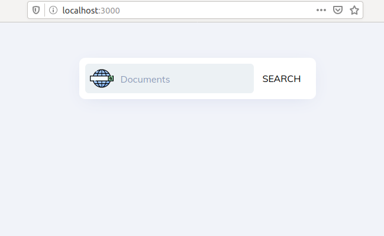
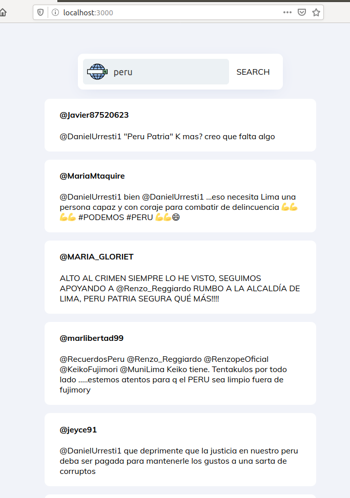
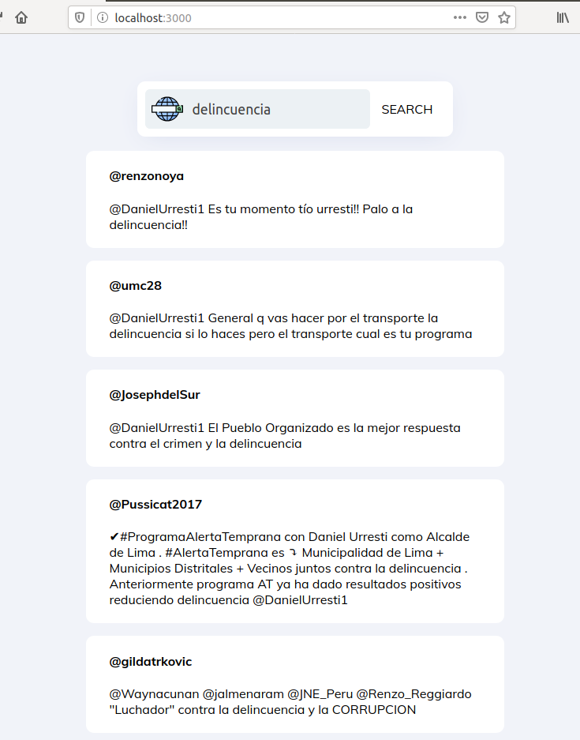

# Base de datos II: Proyecto2
## Integrantes
- Reynaldo Rojas \
- Indhira Ramirez

## Proyecto

## Implementacion Backend
### Preprocesamiento: Tokenization, filtrar stopwords y reduccion de palabras(steamming)
~~~
def ParseNextBlock(self, tweets):
        res = []
        for tweet in tweets:
            if not tweet['retweeted']:
                self.tf_idf[tweet['id']] = {}
                self.N += 1
                for word in tweet['text'].split():
                    if(word[0:4] != 'http'):
                        word = word.translate(str.maketrans(dict.fromkeys(string.punctuation)))
                        word = word.lower()
                        word = self.ps.stem(word)
                    if len(word.strip()):
                        if word not in self.stopwords:
                            res.append((word, tweet['id']))
                            if word not in self.tf_idf[tweet['id']]:
                                self.tf_idf[tweet['id']][word] = 1
                            else:
                                self.tf_idf[tweet['id']][word] += 1
                if not len(self.tf_idf[tweet['id']]):
                    self.N -= 1
                    del self.tf_idf[tweet['id']]
        return sorted(res)
~~~

Tenemos el diccionario tf_idf donde esyan los ids de los tweets y otro diccionario que contiene las palabras de estos y cuantas veces se repite {id: {word: count}}. \ \

ParseNextBLock resive como parametro un json donde se encuentran los tweets, tambien se encarga de la tokenizacion, filtrar las stopwords y el steamming. \ \

Se recorre todos los tweets del json y las palabras del texto de estos. Se separa todas las palabras y si no es un link(http), se le quita la puntuacion, se le pone en lowercase y se reduce la palabra(steamming). Despues de esto, verificamos si esta en las stopwords y si no, se agrega como tupla a un array y se agrega al diccionario. Antes de agregarlo al diccionario se verifica si ya pertenece o no a este para poder llevar el conteo de la palabra. 

### Construccion del indice
#### Estructurar el indice y obtener pesos tf-idf
~~~
def compute_tf_idf(self):
    for doc, word_dict in self.tf_idf.items():
        for word, tf in word_dict.items():
            self.tf_idf[doc][word] = tf * self.idf[word]
    self.normalize()
~~~

~~~
def normalize(self):
    for doc, word_dict in self.tf_idf.items():
        sum = 0
        for _, tf_idf in word_dict.items():
            sum += tf_idf ** 2
        denominator = sqrt(sum)
        for word, tf_idf in word_dict.items():
            self.tf_idf[doc][word] /= denominator
~~~
#### Manejo de memoria secundaria
Blocked sort-Based indexing
~~~
def BSBIndexConstruction(self):
    n = 0
    for file_name in self.file_names:
        n += 1
        with open(file_name) as f:
            block = self.ParseNextBlock(json.load(f))
            block = self.BSBI_Invert(block, file_name)
            block_file_name = "blocks/block_{}".format(n)
            #self.block es un array con todos los nombres de los blocks
            self.blocks.append(block_file_name)
            self.WriteBlockToDisk(block, block_file_name)
    self.MergeBlocks("test_merged")
~~~

ParseNextBlock, se encarga del preprocesamiento de los tweets (Tokenizacion, filtrar stopwords y steamming) y retorna un array ordenado de tuplas donde esta la palabra y el id del tweet donde apartecio ( (word, tweet_id) ).
\\
BSBI\_invert(block, file\_name), tiene como parametros block (array de tuplas) y  
\\
WriteBlockToDisk,block, block\_file\_name), escribe el array block a un archivo con nombre block_file_name
\\
MergeBlocks( final\_file\_name), hace merge de todos los bloques que hay en archivos, cuyos nombres estan en el array blocks. Los archivos ya estan ordenados alfabeticamente, por ello solo les hace merge y lo escribe en final\_file\_name.

### Consultas

## Implementacion Frontend

